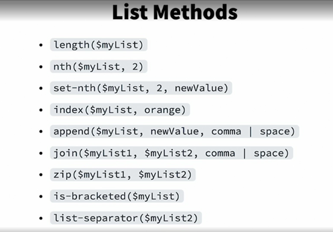

1. `npm create vite@latest .` Dot is to expand the project in current dir or enter the folder name if needed.
2. `npm install -D sass`

## nesting
`
.box {
  padding: 10px;
  .h2 {
    font-weight: 900;
  }
}
`

## comments

1. Unpublished (Silent) Comments (//)
Use // for comments that should not appear in the final CSS output.
These comments are only visible in the SASS/SCSS file.
The comment will be completely removed from the output.

2. Published (CSS-Compatible) Comments (/* ... */)
Use /* ... */ for comments that should appear in the final CSS.
These comments are compiled as standard CSS comments unless compressed (compressed mode removes them).

3. Force-Published Comments (/*! ... */)
Use /*! ... */ to force a comment to remain in the final CSS, even in compressed mode.
Useful for license or copyright notices.

4. add interpolation to comment, the value will be inserted instead of variable name

`$color: #444;
/*Interpolate: #{$color}*/`

## List

In SASS (SCSS), lists are a data type used to store multiple values in a single variable. Lists help organize styles efficiently and allow you to apply multiple values dynamically.

**When to Use Lists?**
✅ For setting multiple values dynamically (e.g., colors, fonts, breakpoints).
✅ When looping through multiple items.
✅ When merging or modifying groups of values.

1. Creating Lists
A list can contain multiple values separated by spaces or commas.

Values in SCSS lists might be quoted or unquoted, depending on the type of value
  - Strings (like font names) can be quoted, but it's not always required.
  - Keywords (like sans-serif, bold, red, etc.) should not be quoted.

2. Accessing List Items (Indexing)
Lists in SCSS are 1-based, meaning the first item has an index of 1. Use the `nth(listName, index)` function to access an item.

`$colors: red green blue;`
`.first-color {`
  `color: nth($colors, 1); // Outputs: color: red;`
`}`

3. Adding and Removing Items
You can use `append()` and `join()` to modify lists. 
**SCSS lists are immutable**, meaning they cannot be changed directly. Instead of modifying a list in place, SCSS functions like append(), join(), and remove() return a new list with the modification applied, leaving the original list unchanged.

`$colors: red green;`
`$new-colors: append($colors, blue);` // red green blue
`$combined: join($list1, $list2); `

4. Looping Through Lists
Use `@each` to iterate through a list.

`@each $color in $colors {`
    `.text-#{$color} {`
        `color: $color;`
    `}`
`}`

SCSS allows destructuring when iterating over lists using @each. This is useful when dealing with nested lists or key-value pairs.

5. Checking List Length `length(listName)`